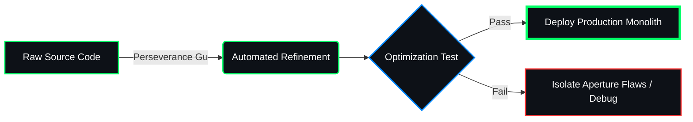

# 🌐 DEMONIC CALCULATION NODE: DEV-ZAKARIA-DEV

  

  

---

## 📊 TELEMETRY DIAGNOSTICS & ANIMATIONS

  

<table width="100%">
  <tr>
    <td width="50%" valign="top">
      <h4>⚡ CORE APERTURE STATS</h4>
      
    </td>
    <td width="50%" valign="top">
      <h4>💾 LINGUISTIC DISTRIBUTION</h4>
      
    </td>
  </tr>
</table>

  

---

## 🛠️ REFINED PATHWAYS (TECH STACK)

  
  
  
   
  
  
  
  
   
  
  
  
  

---

## 🧬 AUTOMATED REFINEMENT PIPELINES

This vector flowchart renders dynamically directly inside GitHub's rendering engine:

