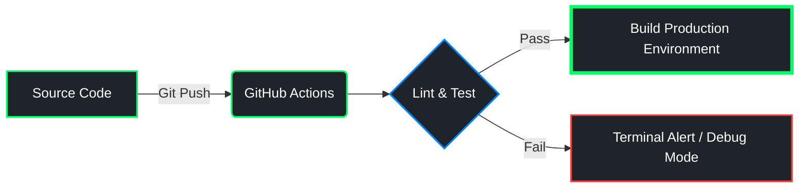

# 🌐 CORE NETWORK NODE: DEV-ZAKARIA-DEV

  

  

---

## ⚡ OPERATIONAL METRICS

<table width="100%">
  <tr>
    <td width="50%" valign="top">
      <h4>📊 DATALINK TELEMETRY</h4>
      
    </td>
    <td width="50%" valign="top">
      <h4>💾 LINGUISTIC DISTRIBUTION</h4>
      
    </td>
  </tr>
</table>

  

---

## 🛠️ TECH STACK ARCHITECTURE

| Layer | Technologies & Frameworks |
| :--- | :--- |
| **Backend Core** | `PHP` `Node.js` `Laravel` `Express` |
| **Frontend Vector** | `JavaScript (ES6+)` `React.js` `Vue.js` `Inertia.js` `Tailwind CSS` |
| **Database Engines** | `PostgreSQL` `MySQL` `MongoDB` `DBeaver` |
| **Environment / Tools**| `Linux (Arch / Ubuntu)` `Git` `VS Code` `Postman` |

---

## 🧬 AUTOMATED CRON & WORKFLOWS

Below is the execution stream tracking real-time logic deployment pipelines.

