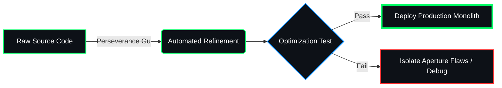

# 🌐 DEMONIC CALCULATION NODE: DEV-ZAKARIA-DEV

<p align="center">
  
</p>


<p align="center">
  
</p>

---

## 📊 TELEMETRY DIAGNOSTICS (CORE PERFORMANCE)

<table width="100%">
  <tr>
    <!-- LEFT PANEL: SYSTEM DIAGNOSTICS -->
    <td width="50%" valign="top">
      <h4>⚡ CORE APERTURE SPECIFICATIONS</h4>
      <p><code>[STATUS: ACTIVE]</code></p>
      <ul>
        <li><b>Rank:</b> Full-Stack Web Developer</li>
        <li><b>Aperture Engine:</b> Modular Monolith Architecture</li>
        <li><b>Primary Realm:</b> Backend Infrastructure Optimization</li>
        <li><b>System Willpower:</b> Unyielding (Perseverance)</li>
      </ul>
      <hr />
      <h4>📈 ALCHEMICAL PROGRESS</h4>
      <code>Database Indexing</code>
      
      <code>Backend Logic (Laravel/Node)</code>
      
      <code>Dynamic SPA (React/Vue)</code>
      
    </td>
    <td width="50%" valign="top">
      <h4>💾 LINGUISTIC DISTRIBUTION RATIOS</h4>
      <p><code>[COMPILING ECOSYSTEM...]</code></p>
      <table>
        <tr><td><b>PHP / Laravel</b></td><td><code>████████████████████████▒▒▒▒</code> 85%</td></tr>
        <tr><td><b>JavaScript / TS</b></td><td><code>██████████████████░░░░░░░░░░</code> 65%</td></tr>
        <tr><td><b>SQL Databases</b></td><td><code>██████████████████████░░░░░░</code> 75%</td></tr>
        <tr><td><b>NoSQL Engines</b></td><td><code>████████████░░░░░░░░░░░░░░░░</code> 40%</td></tr>
      </table>
      <br />
      <blockquote>
        <b>Operational Protocol:</b> Deep focus on eliminating N+1 database constraints, standardizing query speeds, and refining seamless frontend data integration layers.
      </blockquote>
    </td>
  </tr>
</table>

<p align="center">
  <!-- A perfectly stable alternative to track commitments without crashes -->
  
</p>

---

## 🛠️ REFINED PATHWAYS (TECH STACK)

<p align="center">
  
  
  
  <br />
  
  
  
  
  <br />
  
  
  
  
</p>
---

## 🧬 AUTOMATED REFINEMENT PIPELINES

This vector flowchart renders dynamically directly inside GitHub's rendering engine:



Database Indexing Mastery  [████████████████████████████] 100%
Backend Architecture Logic  [████████████████████████░░░░] 85%
Frontend Vector Rendering  [████████████████████░░░░░░░░] 70%

```json
{
  "comms": {
    "linkedin": "[https://linkedin.com/in/YOUR_LINKEDIN_USERNAME](https://linkedin.com/in/YOUR_LINKEDIN_USERNAME)",
    "secure_email": "your.email@example.com"
  },
  "protocols": [
    "RESTful APIs",
    "Calculated Monoliths",
    "Absolute Efficiency"
  ]
}
```
